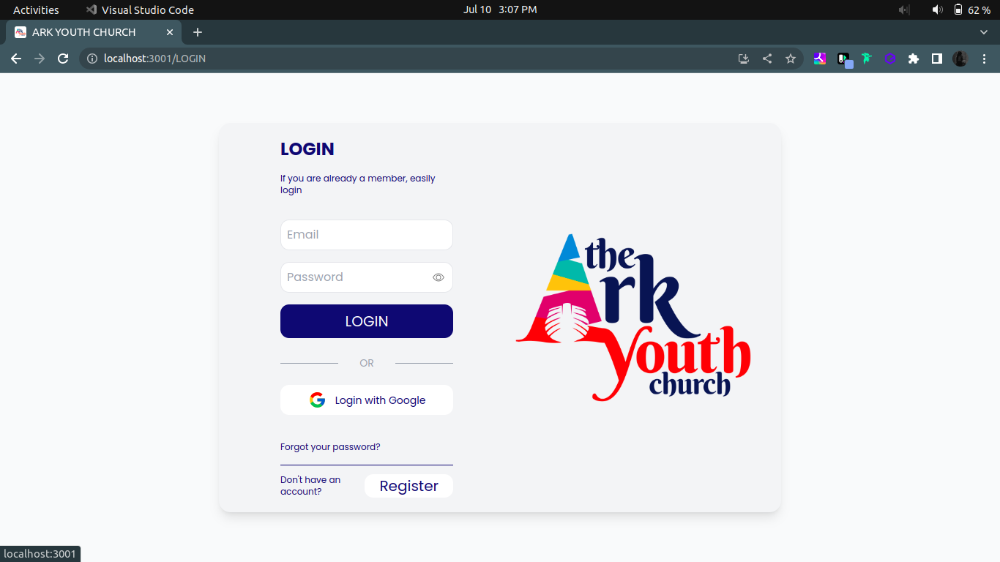
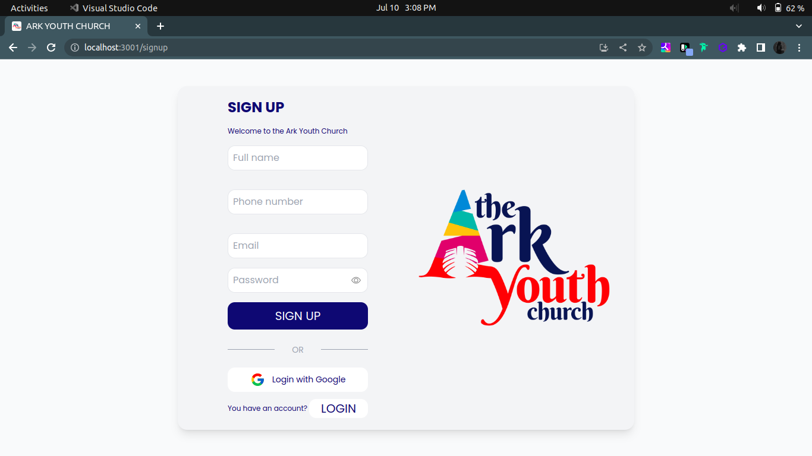

# ARK YOUTH CHURCH

## Live Preview

- [Ark Youth Church Demo](https://ark-church-chi.vercel.app/)

## ARK-CHURCH FRONTEND

- The frontend is a responsive web application optimized for both desktop and mobile devices. It uses React, React Router, Axios, Tailwindcss, and Font Awesome to provide the following functionalities to the users:

- View the details of the frontend

### The app includes several user pages, including

- [ ] landing page.
      
      ---;
- [ ] Event page.
      
      ------------;
- [ ] Squad page.
      
      ---------;
- [ ] About page.
      
      ------;
- [x] Login page.
      
      ---;
- [x] Signup page.
      
      ---;
- [ ] Contact Us page.
      

- [ ] Footer.
      
- [ ] Sermons page.
      

#### It also includes

An admin section where users with administrative privileges can add edit, and delete  data from the database.

- [ ] Admin video upload and delete page contents.
- [ ] Admin podcast upload and delete page page contents.
- [ ] Admin Events upload and delete page contents.

## ARK-CHURCH BACKEND

The backend is built with Fast api and uses PostgreSQL as the database. It provides several API endpoints that the frontend uses to retrieve and manipulate data. The models used in the backend are:

### Authentication

- The User can login and sign up to the website to access features

### Podcast

- The user can access listen for songs and teaches.

### Videos

- The user can access videos.

## Setup

To set up the ARK-CHURCH backend, follow these steps:

Clone the repository:

       https://github.com/ErnestH1/ark-church

### Install dependencies

    bundle install

### Create and migrate the database

    rake db:create
    rake db:migrate
    Seed the database:
    rake db:seed

### Start the server

    rails s

## To set up theARK-CHURCH frontend, follow these steps

#### Clone the repository

    https://github.com/ErnestH1/ark-church

#### Install dependencies

    npm install

#### Start the development server

    npm start

#### Build the production version

    npm run build

## Authors

- [Ernest Hanson](https://github.com/ErnestH1)
- [Casey Ochieng](https://github.com/caseyochieng)
- [Andrew Kimani](https://github.com/Nexus-coder)
- [Collins Kinoti]()
- [Aloo]()

## Conclusion

-
